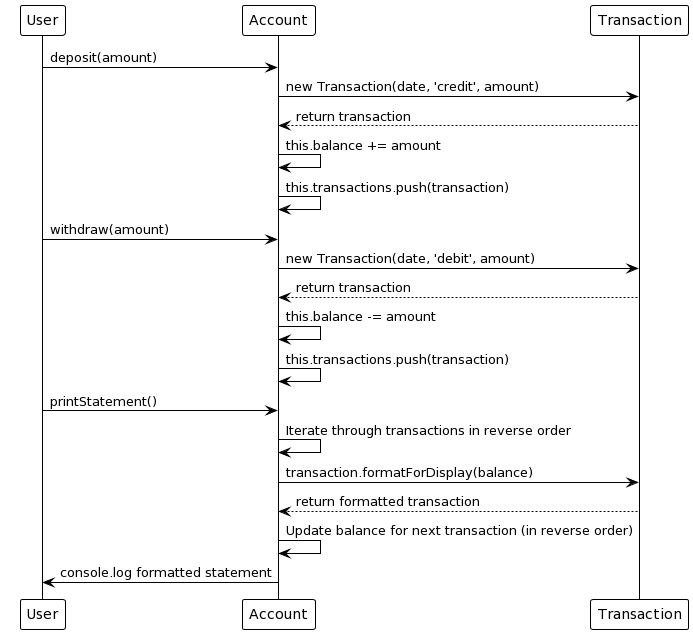

# Bank Tech Test

A simple banking system that allows users to deposit, withdraw, and print an account statement.

## Table of Contents

1. [Specification](#specification)
2. [Approach](#approach)
3. [Installation](#installation)
4. [Running the Tests](#running-the-tests)
5. [Test Coverage](#test-coverage)
6. [Interacting with the Code](#interacting-with-the-code)
7. [Example](#example)

## 1. Specification

### Requirements

* You should be able to interact with your code via a REPL like IRB or Node.  (You don't need to implement a command line interface that takes input from STDIN.)
* Deposits, withdrawal.
* Account statement (date, amount, balance) printing.
* Data can be kept in memory (it doesn't need to be stored to a database or anything).

### Acceptance criteria

**Given** a client makes a deposit of 1000 on 10-01-2023  
**And** a deposit of 2000 on 13-01-2023  
**And** a withdrawal of 500 on 14-01-2023  
**When** she prints her bank statement  
**Then** she would see

```
date || credit || debit || balance
14/01/2023 || || 500.00 || 2500.00
13/01/2023 || 2000.00 || || 3000.00
10/01/2023 || 1000.00 || || 1000.00
```

## 2. Approach

The system consists of two classes: `Account` and `Transaction`. The `Account` class is responsible for managing the balance and the list of transactions, while the `Transaction` class is responsible for storing the details of a single transaction.

The project is implemented using JavaScript and Jest is used for testing.



## 3. Installation

To set up the project, follow these steps:

1. Clone the repository:

```
git clone https://github.com/Diliano/bank-tech-test.git
cd bank-tech-test
```

2. Install the dependencies:

```
npm install
```

## 4. Running the Tests

To run the tests, execute the following command:

```
jest
```

## 5. Test Coverage

The tests provide full coverage of the application's functionality. You can view the test coverage by running the following command:

```
jest --coverage
```


## 6. Interacting with the code

1. Create a new JavaScript file (e.g., `myAccount.js`) in the project directory.

2. In `myAccount.js`, require the `Account` class and create a new `Account` instance:

   ```javascript
   const Account = require('./src/account');
   const myAccount = new Account();
   ```

3. Add deposits and withdrawals to your account using the `deposit` and `withdraw` methods, for example:

   ```javascript
   myAccount.deposit(500);
   myAccount.withdraw(200);
   ```

4. Print your account statement using the `printStatement` method:

   ```javascript
   console.log(myAccount.printStatement());
   ```

5. Run your script with Node.js:

   ```
   node myAccount.js
   ```

## 7. Example

To see a simple example, run the `example.js` file:

```
node example.js
```

This script demonstrates depositing 1000, withdrawing 500 and printing the account statement after each action. 

The JavaScript code being run in `example.js` is as follows:

```javascript
const Account = require('./src/account');
const myAccount = new Account();

myAccount.deposit(1000);
console.log('After depositing 1000:');
console.log(myAccount.printStatement());

myAccount.withdraw(500);
console.log('After withdrawing 500:');
console.log(myAccount.printStatement());
```

The output will look like this:


*Note: The date will be different depending on when you run the code.*


