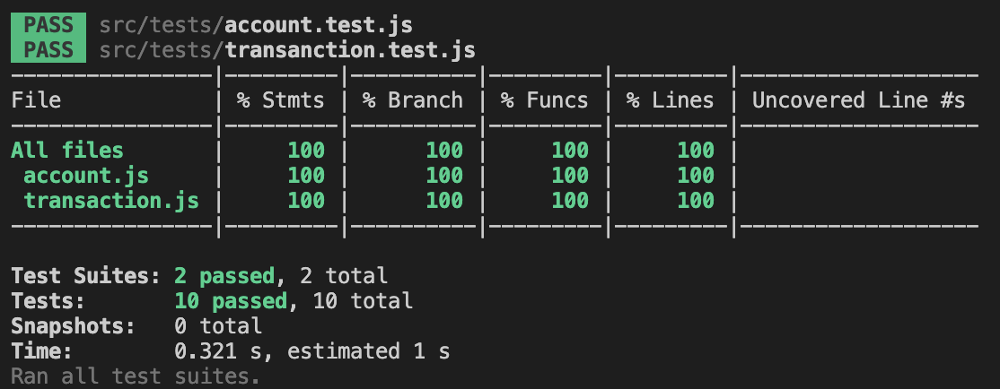
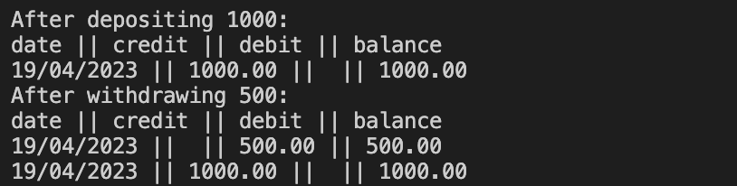

# Bank Tech Test

A simple banking system that allows users to deposit, withdraw, and print an account statement.

## Table of Contents

1. [Approach](#approach)
2. [Installation](#installation)
3. [Running the Tests](#running-the-tests)
4. [Test Coverage](#test-coverage)
5. [Interacting with the code](#interacting-with-the-code)
6. [Example](#example)

## Approach

The system consists of two classes: `Account` and `Transaction`. The `Account` class is responsible for managing the balance and the list of transactions, while the `Transaction` class is responsible for storing the details of a single transaction.

The project is implemented using JavaScript, and Jest is used for testing.


## Installation

To set up the project, follow these steps:

1. Clone the repository:

```
git clone https://github.com/Diliano/bank-tech-test.git
cd bank-tech-test
```

2. Install the dependencies:

```
npm install
```

## Running the Tests

To run the tests, execute the following command:

```
jest
```

## Test Coverage

The tests provide full coverage of the application's functionality. You can view the test coverage by running the following command:

```
jest --coverage
```



## Interacting with the code

1. Create a new JavaScript file (e.g., `myAccount.js`) in the project directory.

2. In `myAccount.js`, require the `Account` class and create a new `Account` instance:

   ```javascript
   const Account = require('./src/account');
   const myAccount = new Account();
   ```

3. Add deposits and withdrawals to your account using the `deposit` and `withdraw` methods:

   ```javascript
   myAccount.deposit(500);
   myAccount.withdraw(200);
   ```

4. Print your account statement using the `printStatement` method:

   ```javascript
   console.log(myAccount.printStatement());
   ```

5. Run your script with Node.js:

   ```
   node myAccount.js
   ```

## Example

To see a simple example, run the `example.js` file:

```
node example.js
```

This script demonstrates depositing 1000, withdrawing 500, and printing the account statement after each action. The JavaScript code being run in `example.js` is as follows:

```javascript
const Account = require('./src/account');
const myAccount = new Account();

myAccount.deposit(1000);
console.log('After depositing 1000:');
console.log(myAccount.printStatement());

myAccount.withdraw(500);
console.log('After withdrawing 500:');
console.log(myAccount.printStatement());
```

The output will look like this:



*Note: The date will be different depending on when you run the code.*


